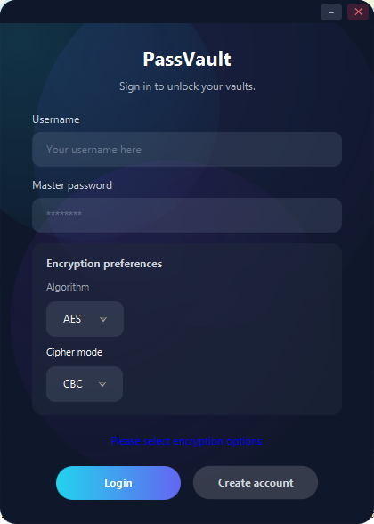
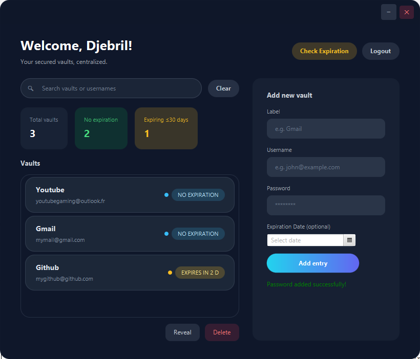

<div align="center">

<!-- Logo -->


<br/>

### *Your secrets. Your machine. Your rules.*

<br/>

[](https://openjdk.org/)
[](https://openjfx.io/)
[](https://en.wikipedia.org/wiki/Galois/Counter_Mode)
[](/)
[](/)

<br/>

[Quick Start](#build-and-run) · [Security](#security-model) · [Architecture](#architecture-overview)

---

</div>

<br/>

# PassVault

> **PassVault** is a **zero-knowledge, offline-first** password manager built with Java 11 and JavaFX. No cloud. No subscriptions. No telemetry. Just military-grade encryption on YOUR machine.

---

## 📸 Screenshots

<div align="center">
<table>
<tr>
<td></td>
<td></td>
</tr>
</table>
</div>

---

PassVault is a Java 11 password vault delivered as a standalone JavaFX desktop application. The code base favors transparent cryptographic flows, explicit persistence boundaries, and a clear separation between the staging logic (controllers) and the encryption primitives that protect each credential at rest.

## Key Characteristics

- Local-only storage under `user_data/`; the application never opens network sockets nor delegates encryption to external services.
- Master-password workflow backed by PBKDF2 (HmacSHA256, 65,536 iterations) and pluggable symmetric algorithms (AES-256, DES, DESede) with modes CBC, ECB, or GCM.
- Layered encryption: session configuration is sealed with AES-GCM, individual credentials are additionally encrypted with the user-selected algorithm/mode before being appended to the vault file.
- JavaFX presentation layer with FXML views (`login.fxml`, `primary.fxml`) and controllers that rely on plain POJOs (`User`, `Config`, `Encryption`, `FileManager`).
- Modular project structure (`module-info.java`) exporting only `com.mycompany.passwordmanager` to the runtime.

## Architecture Overview

- **Entry point**: `MainCLass` (JavaFX `Application`) initialises the transparent stage, loads `login.fxml`, and provides the `setRoot` helper used to swap scenes after authentication.
- **Login flow**: `LoginController` handles registration, algorithm selection, master-password verification via `FileManager.validatePassword`, and transitions to the primary scene upon success. Animated background elements are isolated inside this controller.
- **Vault operations**: `PrimaryController` mediates CRUD operations on credentials, uses observable lists for live filtering, and delegates persistence to the `User` domain object.
- **Domain model**: `User` caches derived keys, coordinates encryption through `Encryption`, and calls `FileManager` to load or persist entries. It also provides dashboard metrics (total entries, expiration tracking).
- **Persistence layer**: `FileManager` maintains two assets per user:
  - `<username>_config.txt` combines the PBKDF2 salt, IV, encrypted configuration payload, and an encrypted verification token (`VALID_PASSWORD`).
  - `<username>_passwords.txt` contains the AES-GCM encrypted vault (Base64 decoded on disk) that stores label, username, encrypted password, and optional expiration as `label||username||ciphertext||yyyy-MM-dd` lines.

## Security Model

1. During registration, the user selects an algorithm and mode. A 16-byte IV is generated and stored alongside a salt.
2. PBKDF2 derives two AES keys:
   - A configuration key (`username + "_config_key"`) used exclusively to encrypt the configuration file with AES-GCM.
   - A file key (`username + "_file_encryption"`) used to seal the aggregated vault file.
3. Each credential is encrypted with the `Config` session key (algorithm/mode chosen by the user). For GCM the IV is reused from the session; for CBC a per-entry IV could be introduced if side-channel protection becomes a requirement.
4. A verification token encrypted with the master password is stored to validate future logins without exposing the password hash.
5. Reads reverse the flow: config decrypted first, PBKDF2 derives keys, the vault file is decrypted, then individual entries are decrypted on demand before presentation.

## Build and Run

### Prerequisites

- Java Development Kit 11 or newer (tested with Temurin 17).
- Maven 3.6 or newer.

### Commands

```powershell
mvn clean javafx:run
```

The Maven `javafx-maven-plugin` defined in `pom.xml` orchestrates compilation and launches the JavaFX runtime.

To produce a runtime image with the JavaFX modules included:

```powershell
mvn clean package javafx:jlink
```

Artifacts are emitted under `target/PasswordManager-<version>/`. The `bin/` subdirectory contains platform-specific launch scripts referencing the custom runtime image.

### IDE Support

The project includes `nbactions.xml` for NetBeans execution profiles. When importing into other IDEs (IntelliJ IDEA, Eclipse), ensure the JavaFX modules are configured and VM options (`--module-path <javafx-lib> --add-modules javafx.controls,javafx.fxml`) are applied if you are not relying on the Maven plugin.

## Runtime Configuration

- **Algorithms**: AES (default), DES, DESede. The selection drives PBKDF2 key size (256, 56, 168 bits respectively).
- **Modes**: CBC, ECB, GCM. GCM removes padding and provides tag-based authentication via `GCMParameterSpec`.
- **Storage path**: `user_data/` is created adjacent to the executable. Place this directory under version control ignore rules and back it up securely.
- **Rate limiting**: `LoginController` enforces a three-attempt limit before terminating the application to mitigate brute force attempts on the master password.

## User Interface Flow

1. **Login/Registration**: Users authenticate or configure a new vault. Registration writes the config/verification pair before routing to the primary scene.
2. **Dashboard**: `PrimaryController` presents an observable list of entries, search filtering, and computed statistics (total entries, expiring within 30 days, entries without expiry).
3. **Credential lifecycle**: Additions are validated client-side, encrypted, persisted via `User.addPassword`, and immediately reflected in the list view. Deletions rewrite the vault file via `FileManager.overwritePasswords` to avoid stale entries.
4. **Expiration monitoring**: Users can query upcoming expirations; calculations rely on Java's `ChronoUnit` to derive day deltas.

## Project Layout

```
src/main/java/com/mycompany/passwordmanager/
├─ App.java                # simple main wrapper (delegates to JavaFX Application)
├─ MainCLass.java          # JavaFX Application bootstrap, scene switching
├─ LoginController.java    # authentication, registration, rate limiting
├─ PrimaryController.java  # vault UI, CRUD operations, statistics
├─ User.java               # domain model, key derivation, credential store
├─ Encryption.java         # PBKDF2, AES/DES helpers, GCM handling
├─ FileManager.java        # encrypted persistence for configs and vault files
├─ Config.java             # immutable session configuration snapshot
└─ module-info.java        # module declaration exporting public API

src/main/resources/com/mycompany/passwordmanager/
├─ login.fxml              # login/registration layout
├─ primary.fxml            # main vault layout
└─ styles.css              # JavaFX styling
```

## Extensibility Notes

- Implement additional cipher algorithms or per-entry IV randomisation by extending `Encryption` and adapting `Config` to hold per-entry metadata.
- Replace the local file persistence with a database-backed implementation by providing a new persistence adapter and adjusting `User` to depend on an interface rather than `FileManager` directly.
- Introduce test coverage by wiring in TestFX for UI and JUnit/Mockito for domain and persistence layers; the current repository does not include automated tests.
- Harden against side-channel leakage by zeroising sensitive fields after use and by splitting the verification token storage into structured metadata (e.g. JSON) rather than the current delimiter-based flat file.

## Operational Guidance

- Back up the `user_data/` directory after each session; without it the vault cannot be reconstructed.
- Monitor `user_data/<username>_config.txt` for unexpected modifications; changes to the salt or IV will invalidate the stored verification token.
- When rotating the master password, update both the config verification token and re-encrypt the vault to maintain consistency.
- For distribution, bundle the application with the generated runtime image to avoid end-users managing JavaFX dependencies manually.

## License

MIT License. See `LICENSE` for more information.

---

<p align="center">
  <b>⭐ If PassVault is useful to you, feel free to star the project! ⭐</b>
</p>

---

### 🔑 Keywords

`password manager` `java password manager` `javafx application` `secure password storage` `aes-256 encryption` `local password manager` `offline password manager` `open source password manager` `java cryptography` `pbkdf2 java` `aes encryption` `digital vault` `cybersecurity` `credential management` `desktop password manager`
